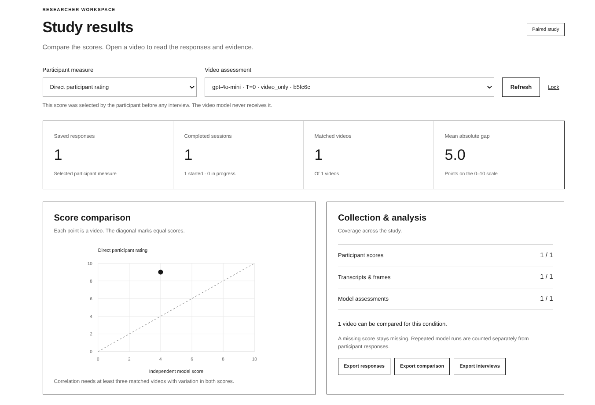
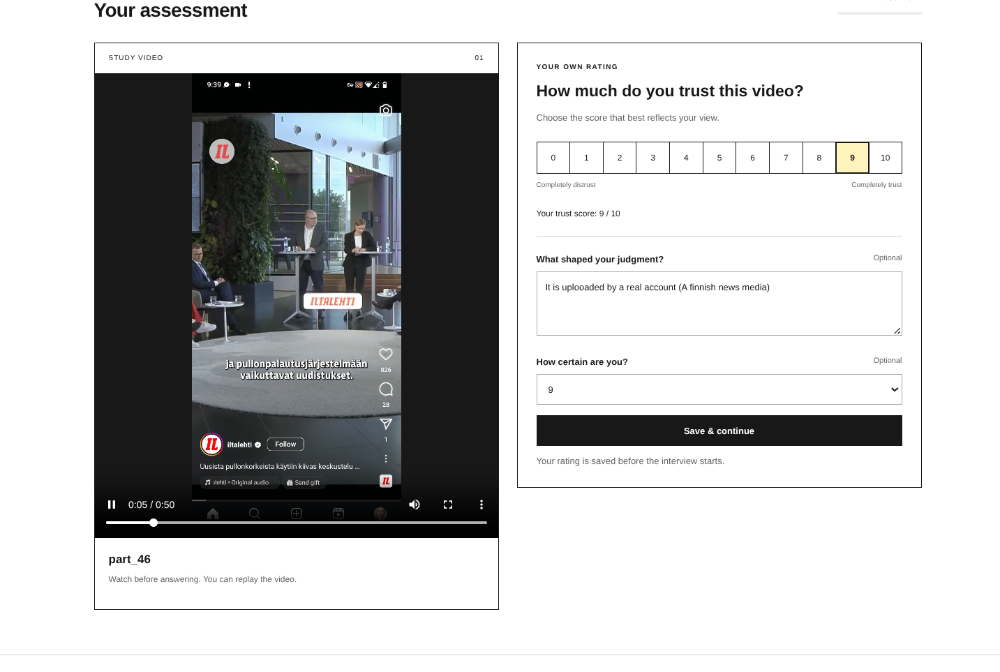
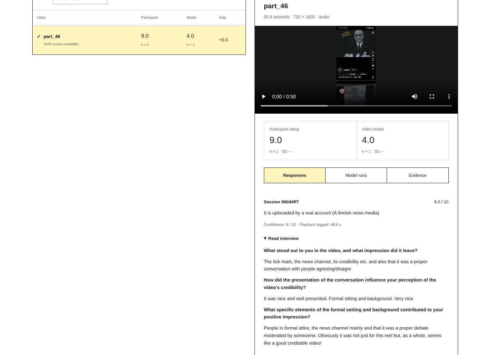
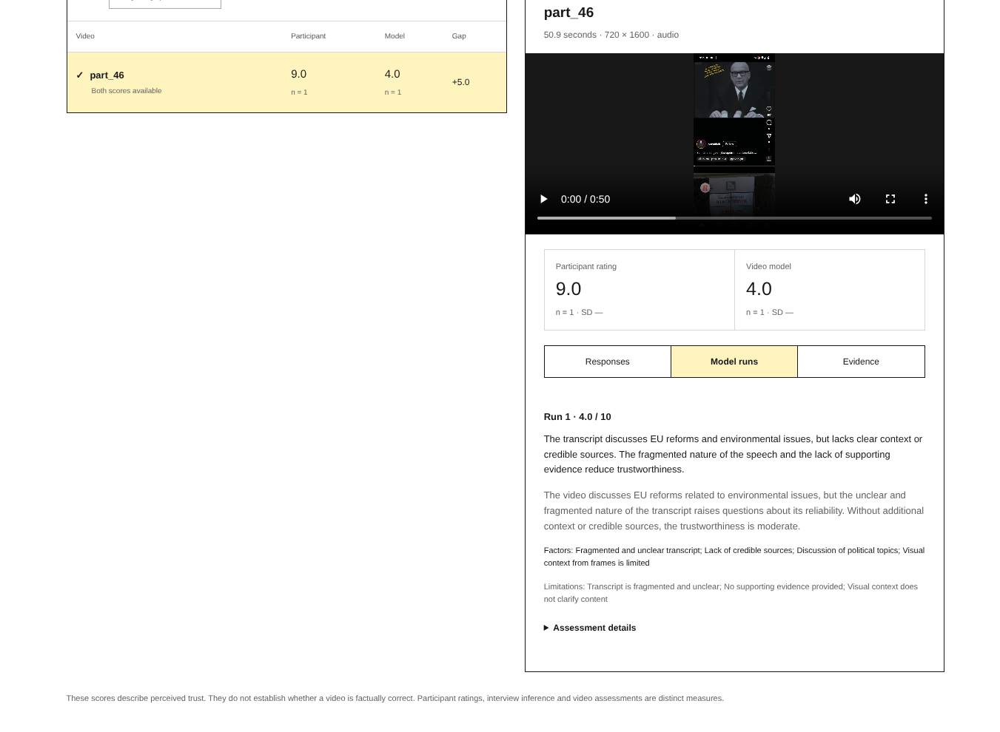
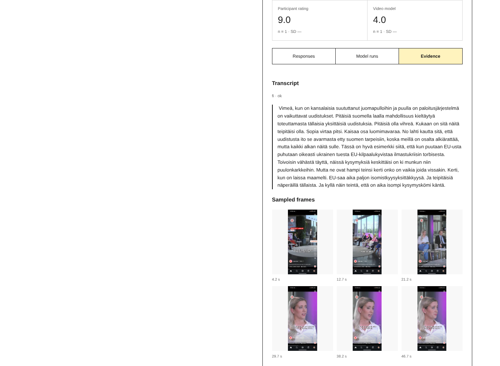

# Trust-LLMHuman-VideoComparison

**What makes a video feel trustworthy—and do people and language models rely on the same cues?**

This research toolkit lets people watch a video, give a trust rating, and explain their judgment in a short interview. Separately, a language model assesses a transcript and sampled video frames. A researcher dashboard brings the scores, explanations and evidence together.

The aim is to investigate **how trust is formed**: the role of a familiar publisher, a verification badge, a formal setting, the substance of a claim, or information missing from the model's input. A disagreement is a starting point for investigation, not a verdict about who is right.

Originally developed for a Human–Computer Interaction course at the **University of Helsinki**, the project has since been extended by **Vaibhav Agarwal** so that other researchers can adapt it to their own studies.

[Try it locally](#try-it-locally) · [Run a live pilot](#run-a-live-pilot) · [Design a study](#design-a-study) · [Technical details](#technical-details) · [Contact and credit](#contact-and-credit)

## A real example: one video, two judgments

The examples use just **`part_46`**, a 50.9-second Finnish news/debate clip. In the author's exploratory pilot:

| Assessment | Score | What shaped the judgment |
| --- | ---: | --- |
| Participant's own rating | **9 / 10** | Recognition of Iltalehti, the account's visible verification badge, formal presentation and a moderated discussion. |
| Independent video assessment | **4 / 10** | The model described a fragmented transcript, missing context and insufficient supporting evidence. |
| Difference | **+5 points** | Participant rating minus model rating. |

This suggests a useful question: **does recognizing the source change how people and models interpret the same content?**

The example does not establish the cause of the difference. Source branding is visible in some sampled frames, so we cannot conclude that the model never saw it. It may have missed or given less weight to those cues. The automatic Finnish transcript also contains errors, which offer another plausible explanation. One participant and one model run cannot establish a general pattern.

See the participant's explanation, model reasoning and evidence

These are screenshots of the author's actual pilot. The offline demo contains the model score and wording transcribed from the screenshot, labelled **recorded example**. The original API response and complete run metadata were not supplied, so that excerpt is not a full replication record. The bundled transcript and frames were prepared locally from the same clip. They are not presented as a recovered API request.

The demo starts with no participant responses. Your own rating is collected afresh; the earlier rating of 9 is not inserted into your data. A fresh model run may produce a different score.

## Contact and credit

**Vaibhav Agarwal · [vaibhav.agarwal@tum.de](mailto:vaibhav.agarwal@tum.de)**

If this project is useful for your research, please get in touch. I would be interested in discussing the research question, a possible collaboration, or customization. I do not have dedicated funding or time to develop features on request; help with adaptation depends on availability.

The software is released under the **[MIT license](LICENSE)**. Copies and substantial portions must retain the copyright and license text. Please also credit the project when you use or adapt it in research; [CITATION.cff](CITATION.cff) provides citation metadata. Forking and reuse are permitted under the license. Contact and collaboration are encouraged, not additional license conditions.

The bundled news clip and third-party footage, logos and platform elements visible in screenshots are outside the software license. The clip visibly carries Iltalehti branding; inclusion does not transfer rights to the underlying content or imply endorsement. Check the permissions needed for your own reuse or study distribution.
