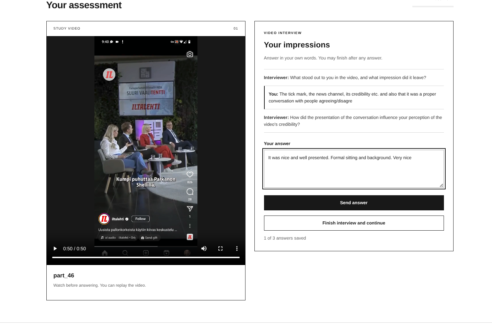
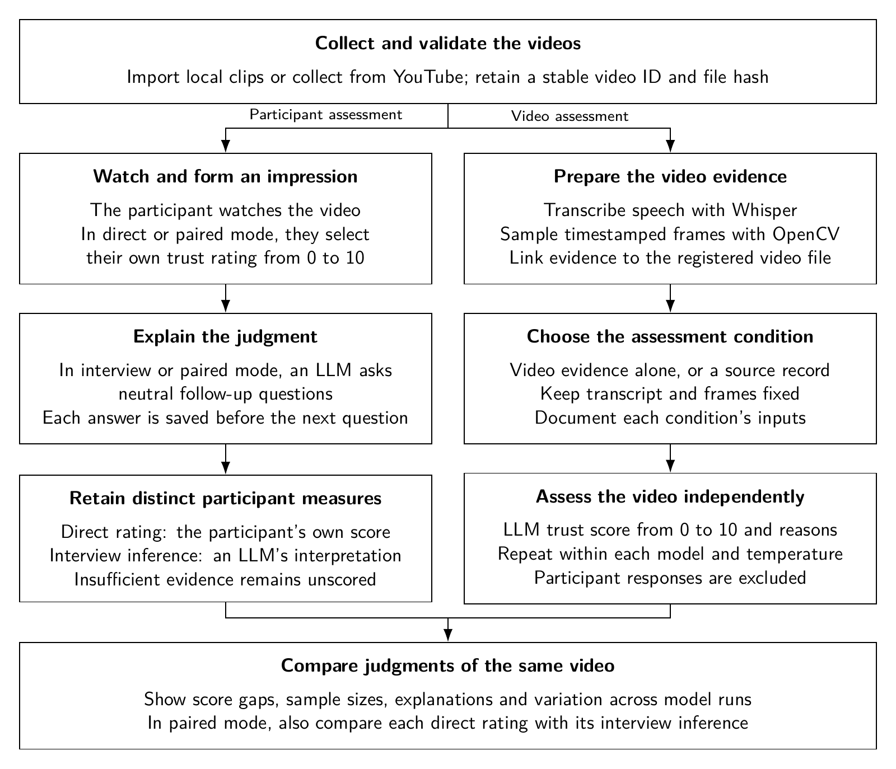

# Trust-LLMHuman-VideoComparison

**What makes a video feel trustworthy?** 

**Do people and language models rely on the same cues?**

Here is a project I worked on during the Human Computer Interaction Course by Giulio Jacucci in Winter 2024 at the University of Helsinki. 

This is a complete frontend-backend survey software which lets people watch a video, give a trust rating, and explain their judgment in a short interview hosted by a chatbot. Separately, a language model assesses a transcript and sampled video frames. A researcher dashboard brings the scores, explanations and evidence together to understand the differences in trust and, if **people and language models rely on the same cues which accessing trust!**

The aim was to investigate **how trust is formed**: the role of a familiar publisher, a verification badge, a formal setting, the substance of a claim, or information missing from the model's input etc. 

I would be happy to allow other researchers to adapt it to their own studies; however, if this project is useful for your research, please get in touch. I would be interested in discussing the research question, a possible collaboration, or customization. At present, I do not have funding or time to develop features on request; help with adaptation depends on availability and interest! 

The software is released under the **[MIT license](LICENSE)**. Please also credit the project when you use or adapt it in research; [CITATION.cff](CITATION.cff) provides citation metadata. Forking and reuse are permitted under the license. Contact and collaboration is encouraged. 

[Try it locally](#try-it-locally) · [Run a live pilot](#run-a-live-pilot) · [Design a study](#design-a-study) · [Technical details](#technical-details)


## A real example: one video, two judgments

The examples use just **`part_46`**, a 50.9-second Finnish news/debate clip. In the author's exploratory pilot:

| Assessment | Score | What shaped the judgment |
| --- | ---: | --- |
| Participant's own rating | **9 / 10** | Recognition of Iltalehti, the account's visible verification badge, formal presentation and a moderated discussion. |
| Independent video assessment | **4 / 10** | The model described a fragmented transcript, missing context and insufficient supporting evidence. |
| Difference | **+5 points** | Participant rating minus model rating. |

This suggests a useful question: **does recognizing the source change how people and models interpret the same content?**

The example does not establish the cause of the difference. Source branding is visible in some sampled frames, so we cannot conclude that the model never saw it. It may have missed or given less weight to those cues. The automatic Finnish transcript also contains errors, which offer another plausible explanation. One participant and one model run cannot establish a general pattern.

<details>
<summary>See the participant's explanation, model reasoning and evidence</summary>


These are screenshots of the author's actual pilot. The offline demo contains the model score and wording transcribed from the screenshot, labelled **recorded example**. The original API response and complete run metadata were not supplied, so that excerpt is not a full replication record. The bundled transcript and frames were prepared locally from the same clip. They are not presented as a recovered API request.

The demo starts with no participant responses. Your own rating is collected afresh; the earlier rating of 9 is not inserted into your data. A fresh model run may produce a different score.

</details>

## Try it locally

**Start here.** You need Python 3.11 or newer; Python 3.12 is a straightforward choice. The demo needs no API key, FFmpeg, GPU, Node.js or paid service. It includes the video, a prepared transcript, six frames and the recorded model example.

### 1. Download and open the project

On this repository's GitHub page, choose **Code → Download ZIP**, then extract it. Open a terminal in the extracted folder—the one containing `README.md` and `pyproject.toml`.

### 2. Install and start

**macOS or Linux**

```bash
python3 -m venv .venv
source .venv/bin/activate
python -m pip install .
trust-video demo --paired
```

**Windows — PowerShell**

```powershell
py -3 -m venv .venv
.\.venv\Scripts\python.exe -m pip install .
.\.venv\Scripts\trust-video.exe demo --paired
```

On Windows, use `.\.venv\Scripts\trust-video.exe` wherever later instructions say `trust-video`, and `.\.venv\Scripts\python.exe` wherever they say `python`. This avoids changing PowerShell's execution policy.

Keep the terminal open. It prints the survey address, researcher address and a **researcher token**. The application runs on your own computer.

### 3. Try the participant side

Open **[http://127.0.0.1:8000](http://127.0.0.1:8000)**.

1. Read the study information and agree to participate.
2. Watch `part_46`, choose a score from 0 to 10, and optionally explain why.
3. Save the rating, then answer the interview questions. You can finish after your first answer.
4. Look for the confirmation that your responses have been saved.

The offline interview uses fixed questions and makes no model calls. It saves your answers but leaves the inferred interview score empty.



### 4. Try the researcher side

Open **[http://127.0.0.1:8000/researcher](http://127.0.0.1:8000/researcher)** in another tab. Paste the researcher token from the terminal.

- Leave **Participant measure** on **Direct participant rating** to compare your score with the recorded model score of 4.
- Select `part_46` and use **Responses**, **Model runs** and **Evidence** to read both explanations and inspect the transcript and frames.
- Use **Export responses**, **Export comparison** or **Export interviews** to save CSV or JSON files.

If you enter 9, the displayed difference should be **+5**. If you choose another score, the difference should change accordingly. Selecting interview inference in an offline demo shows an unscored response; it does not create a numeric judgment.

### 5. Stop, resume or start fresh

Press **Ctrl+C** in the terminal to stop. Run the same command to resume the saved workspace. Reloading the participant tab preserves its session and draft answers. Open a private browser window to try another participant session.

For a fresh demo, use a new folder:

```bash
trust-video demo --paired --workspace data/another-demo
```

Responses stay in `data/demo-part46-paired/` by default. A new researcher token is printed each time the server starts. Add `--port 8001` if port 8000 is already in use.

<details>
<summary>Other demo modes and Docker</summary>

```bash
trust-video demo              # Direct rating only
trust-video demo --interview  # Interview only
```

Each mode has its own default workspace. The existing `videotrust` command and `python -m videotrust` also work.

If you already use Docker:

```bash
docker build -t trust-video .
docker run --rm -p 127.0.0.1:8000:8000 -v trust-video-data:/data trust-video
```

The container starts the paired offline demo. The named volume keeps responses across restarts. Docker is optional; the Python installation is the primary tested route.

</details>

## Run a live pilot

This creates a **separate workspace** and generates new model assessments. It does not copy the recorded score or demo responses.

### 1. Install the analysis tools

From the project folder, with the same Python environment:

```bash
python -m pip install ".[analysis]"
```

Install **[FFmpeg](https://ffmpeg.org/download.html)**, including `ffprobe`, and check that both commands work:

```bash
ffmpeg -version
ffprobe -version
```

For example, Ubuntu/Debian users can run `sudo apt install ffmpeg`; macOS users with Homebrew can run `brew install ffmpeg`. Windows builds are linked from FFmpeg's download page. Restart your terminal after adding FFmpeg to PATH.

Whisper runs locally. The first transcription downloads its model; this can take time and disk space. A CPU is sufficient for a short pilot.

### 2. Set your API key

Obtain a key from your own [OpenAI API account](https://platform.openai.com/api-keys). Live video assessments and interviews use that account's API billing. The key is read by the Python server and is never sent to the participant browser.

macOS/Linux:

```bash
export OPENAI_API_KEY="your-api-key"
```

Windows PowerShell:

```powershell
$env:OPENAI_API_KEY = "your-api-key"
```

The `.env.example` file lists supported settings; `.env` files are not loaded automatically.

### 3. Prepare the example

```bash
trust-video example
trust-video prepare --whisper-model base --language fi --frames 6
```

This registers the bundled clip in `data/study/` and sets up a paired pilot. Before analysis, review the transcript in `data/study/evidence/` against the audio. Successful transcription does not mean accurate transcription. If the transcript needs improvement, try `--whisper-model small --force`, or use a separately documented human-corrected transcript in a new study workspace.

### 4. Assess the video, then open the study

```bash
trust-video analyze --model gpt-4o-mini --evidence-mode video_only
trust-video serve
```

Open the printed survey and researcher addresses just as in the offline demo. This time, interview follow-ups and interview interpretation call the live model. The independent video assessment never receives participant responses. Its score is not shown to participants.

A useful pilot check is: video plays; rating survives reload; interview answers are saved; the dashboard displays a fresh model run; both export files and explanations match what you entered. A score different from 4 is a possible new result, not an installation failure.

For another pilot, add the **same new `--workspace data/pilot2`** to every command above. Existing response data is never overwritten.

## Design a study

The three measures answer different questions:

| Measure | Input | Meaning |
| --- | --- | --- |
| Direct participant rating | A person's own 0–10 selection | How much that person reports trusting the video. |
| Interview inference | That person's written answers | An LLM's interpretation of expressed trust; inconclusive answers can remain unscored. |
| Independent video assessment | Title, transcript, sampled frames and the chosen context | The model's judgment from the supplied evidence. |

Use the direct rating for the main human–model comparison. Interviews help investigate the reasons behind it. Paired mode also lets you examine whether interview inference agrees with a person's own score. Rating first may influence what people say next; the order is part of the study design.



[Editable LaTeX/TikZ](workflow.tex) · [PDF for papers and presentations](assets/workflow.pdf)

### Investigating the source-recognition hypothesis

The new `source_context` condition adds a researcher-supplied source description to the same video evidence. It excludes comments and unrelated engagement metadata. This supports a focused model-side comparison with `video_only`.

For a useful experiment, hold the transcript, sampled frames, title, prompt version, model and temperature fixed while varying the source information. Record how the source was identified; a visible badge is not independent verification. Separately evaluate transcription quality so that source information and speech-recognition errors are not changed together.

People already see branding and hear continuous audio in this clip. Adding source context to the model does not equalize their exposures. A human-side causal study would also need a planned manipulation, random assignment, adequate participants/videos and appropriate review. These are study-design decisions rather than automatic features of the application.

<details>
<summary>Set up the source-context comparison</summary>

Create a new pilot with `trust-video example --workspace data/source-study`. Before starting its server, open `data/source-study/catalog.json` in a text editor. Replace that video's empty `"metadata": {}` with:

```json
"metadata": {
  "source_context": {
    "publisher": "Iltalehti",
    "basis": "The researcher identified the visible account handle and news branding in the clip. Publisher identity and this upload have not been independently verified."
  }
}
```

Use a documented source URL and verification method if you have them; do not describe an unverified attribution as verified. Do not insert participant ratings or interview answers here.

```bash
trust-video prepare --workspace data/source-study --language fi
trust-video analyze --workspace data/source-study --evidence-mode video_only
trust-video analyze --workspace data/source-study --evidence-mode source_context
trust-video serve --workspace data/source-study
```

Use the dashboard's **Video assessment** selector to inspect the separate conditions. To investigate variability, add `--runs 3` to each analysis command. Re-running completed jobs skips them; increasing the run count adds only missing repetitions.

</details>

### Bring your own videos

```bash
trust-video register --input "path/to/your/videos" --workspace data/my-study --response-mode paired
```

Use H.264 MP4 with AAC/MP3 audio, or VP8/VP9 WebM with Opus/Vorbis audio. Registration checks metadata and decodes the first frame; pilot full playback before recruitment. A single video path also works. Invalid files are reported; `--skip-invalid` explicitly allows a valid subset.

Before the first `serve`, edit `data/my-study/study.json`: study title, contact, consent wording/version, retention and withdrawal information, number of videos per session, response mode and interview length. Then use `prepare`, `analyze` and `serve` with `--workspace data/my-study` on each command.

The catalog and study settings are frozen when the response database is first created, including by `serve` or `report`. Use a new workspace for design changes. Default workspaces and databases are excluded from Git.

## Technical details

<details>
<summary>Architecture, evidence and exports</summary>

Python serves a plain HTML/CSS/JavaScript interface and stores responses in SQLite. There is no frontend build step. Optional processing uses Whisper and OpenCV; API requests use Python's standard library.

| File or directory | What it contains |
| --- | --- |
| `catalog.json`, `study.json` | Video identities, media hashes and study settings. |
| `responses.sqlite3` | Sessions, direct ratings, interview turns and inferred assessments. |
| `evidence/`, `frames/` | Automatic transcript, timing and sampled images. |
| `analyses.jsonl` | Successful live assessments, raw validated output and model/prompt/evidence provenance. |
| `*_report.json`, `analysis_errors.jsonl` | Preparation, registration or provider failures. |
| `comparison.csv`, `comparison.json` | Exports produced by `trust-video report`. |

Live runs retain requested/resolved model, temperature, repeat index, prompt/evidence hashes and available response metadata. Model conditions stay separate. A score of zero is valid; failed or missing results do not become zero. Temperature zero is not a guarantee of identical results.

`video_only` supplies title, transcript and sparse frames. `source_context` adds only the source description. `metadata_comments` additionally supplies catalog metadata and up to ten comments. `legacy_enriched` uses text representations: transcript, generated visual summary, presentation format, topic cluster and comment sentiment, without images at the final assessment step.

Frames are sampled at evenly spaced midpoints, resized to at most 768 pixels on their longest side, and sent with low image detail. Small badges or text may become hard to recognize. People hear audio and see continuous video; the model does not. Neither pipeline independently fact-checks claims.

Video-level gap = participant mean − model mean. The dashboard shows counts and sample standard deviations, and keeps model repetitions separate from participant counts. Correlation appears only with at least three matched videos and variation on both axes; it is descriptive, not a significance test or measure of truth. The paired interview panel instead reports inferred score − direct rating for the same session/video. Sessions are not verified unique people.

```bash
trust-video doctor --workspace data/study
trust-video report --workspace data/study
```

The dashboard's exports also include participant CSV and interview JSON. Spreadsheet-leading formulas are escaped in CSV; the database retains the original text. Stop the server before copying the complete workspace for a simple backup. For a running server, use SQLite's backup API.

</details>

<details>
<summary>Optional collection, enrichment and earlier code</summary>

Local videos are sufficient for the main workflow. YouTube collection is optional:

```bash
python -m pip install ".[collection,enrichment]"
trust-video collect --workspace data/collected --query "your study query" --regions FI --limit 10 --download
```

Collection needs `YOUTUBE_API_KEY`, and downloads depend on source availability and access. Enrichment can add visual summaries, presentation labels, comment sentiment and topic clusters:

```bash
trust-video enrich --workspace data/study --clusters 1
trust-video analyze --workspace data/study --evidence-mode legacy_enriched
```

Prepare evidence first. `--clusters 1` suits the one-video example; a meaningful corpus needs an appropriate cluster count and substantive validation. VADER sentiment is based on an English lexicon and does not validate a video's claims or reliably interpret every language.

Earlier scripts remain in `legacy/source/` as historical code, with credentials redacted. They are not required to run the package. The `recover-legacy` and `restore-media` commands support old local files; imported historical records remain separate from new assessments.

</details>

<details>
<summary>Tests and common problems</summary>

From the project root:

```bash
python -m pip install -e .
python -m unittest discover -s tests -v
```

The tests cover response persistence, valid zero scores, study freezing, protected researcher routes, model-condition separation, duplicate prevention, failed-provider recovery, concurrent sessions and media handling. Optional media/enrichment checks run when their dependencies are installed. Provider tests use controlled responses and do not make paid calls.

Browser checks cover actual `part_46` playback, direct/interview/paired flows, exports, draft recovery and mobile layout:

```bash
npm install --no-save --package-lock=false playwright
npx playwright install chromium
python tests/run_browser.py
```

These tools are for contributors; participants and researchers do not need Node.js.

| Problem | What to do |
| --- | --- |
| Command is not found | Activate the environment, or use its full executable path as in the Windows instructions. |
| Port 8000 is busy | Add `--port 8001` and open the printed address. |
| Researcher token is rejected | Use the token from the currently running terminal. |
| Study settings changed | Start a new workspace; an existing response database intentionally rejects changed study settings. |
| No model comparison | Check the selected participant measure and `analysis_errors.jsonl`; offline interviews intentionally have no inferred score. |
| Whisper/OpenCV/FFmpeg is missing | Install the analysis extras and FFmpeg in the environment used to run the commands. |
| API request fails | Check model access, API billing and credentials; a saved interview answer can be retried without resubmitting it. |
| Transcript is inaccurate | Review against the audio; evaluate a larger or language-appropriate transcription model before interpreting differences. |

</details>

### Before recruiting participants

The included server is intended for local pilots. Publishing the code on GitHub does not host the study. Internet recruitment needs suitable hosting, HTTPS, access/rate controls, backups and an institutional data/consent review. Live interviews send participant text to OpenAI; video assessment sends transcript and sampled frames. The researcher token protects results, not access to the public-facing study or its media.

