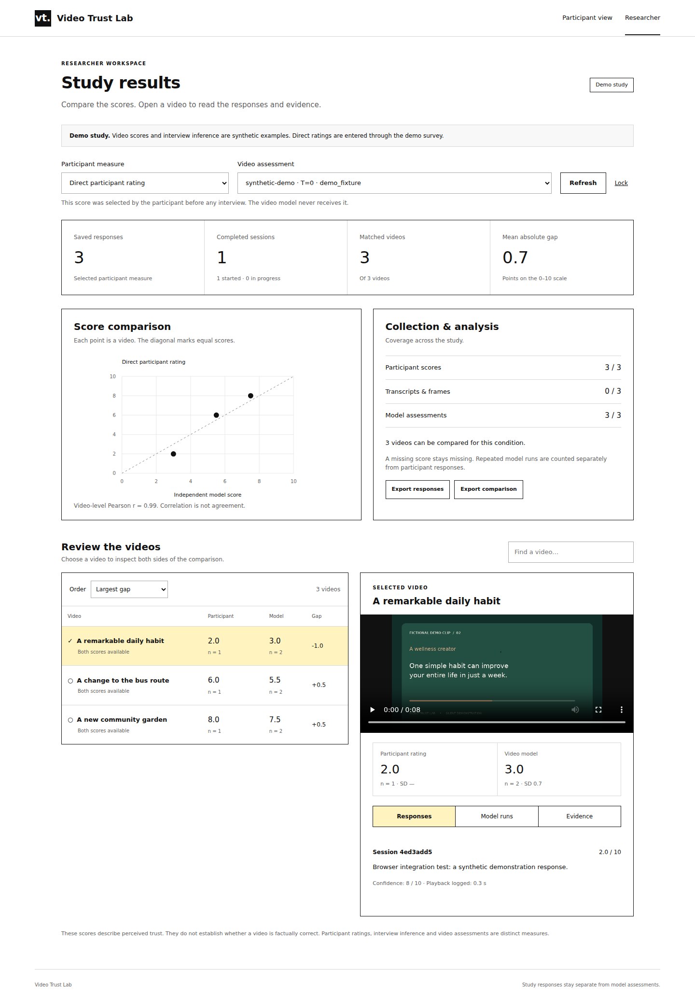
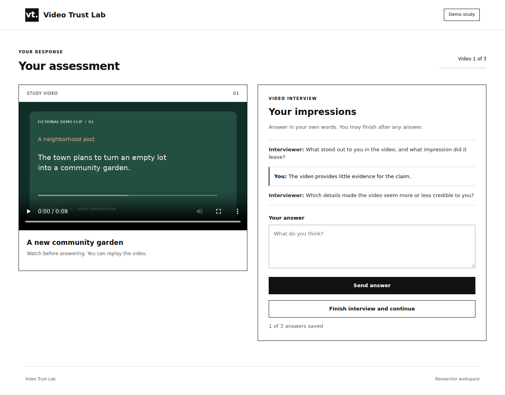

# Video Trust Lab

Compare how people and language models judge the trustworthiness of the same short video.

A research project by **Vaibhav Agarwal**. The application brings together a video survey, adaptive interviews, YouTube collection, Whisper transcription, OpenCV frame sampling, visual summaries, topic clustering, and repeated model assessments.



The study workflow is available as [black-and-white PDF](docs/assets/workflow.pdf) and editable [LaTeX/TikZ](docs/workflow.tex).

## Start here

Requires **Python 3.11+**. The demo needs no API key, package installation, or frontend build.

```bash
python -m videotrust demo
```

Open **http://127.0.0.1:8000**. Three fictional, silent video clips are included. Responses are saved locally, and reloading the page resumes your current session in the same tab.

To test both participant measures on the same video:

```bash
python -m videotrust demo --paired --port 8001
```

Open **http://127.0.0.1:8001**. Give your own rating first, then complete the interview. Use `--interview` for an interview-only study. Demo questions are scripted and inferred scores are fixed synthetic examples. Live studies use adaptive LLM questions and a separate participant-trust inference.

Open `/researcher` on either server and enter the access token printed in its terminal. The dashboard shows matched video scores, sample sizes, variation and missing assessments. Open a video to review participant responses, full interviews, model runs, transcripts and sampled frames. Exports include responses, the selected comparison and conversations. Ctrl+C stops the server; saved responses remain.



## Choose the participant flow

| Study mode | Participant activity | What the score means |
|---|---|---|
| `direct` | Watch, select 0–10, optionally explain | The participant's own numeric rating |
| `interview` | Watch and answer neutral follow-up questions | An LLM's interpretation of the participant's stated trust |
| `paired` | Give a direct rating, then complete the interview | Both measures, linked by session and video |

Each workspace uses one mode. In paired mode, a selector keeps the measures separate; an additional agreement panel compares each direct rating with its corresponding inference. Exports never average the two together. The independent video assessment does not receive participant answers. Participants do not see model scores. An inconclusive live interview can produce a **null score**, rather than an invented rating.

## Use real videos

```bash
python -m videotrust register --input /path/to/videos --workspace data/study
```

The importer checks metadata, codecs and the first decoded frame. Incomplete or incompatible files are rejected before the catalog is written. Use `--skip-invalid` to retain valid clips and inspect `registration_report.json`. H.264/AAC MP4 and VP8/VP9 WebM are supported. This check does not certify every frame of a file. Edit `data/study/study.json` before starting the server: set the consent information, researcher contact, and number of videos per session. Direct rating is the default. To use live interviews, add:

```json
{
  "response_mode": "paired",
  "interview_model": "gpt-4o-mini",
  "interview_turns": 3
}
```

Merge these fields into the existing file; retain its title, consent, and session settings. Explain in the consent text that live interview answers are sent to the model provider. Then:

```bash
export OPENAI_API_KEY='your-new-key'
python -m videotrust serve --workspace data/study
```

In PowerShell, use `$env:OPENAI_API_KEY = 'your-new-key'`. Direct surveys do not need this key. The `.env.example` file documents settings; `.env` is not loaded automatically.

The first server start freezes the catalog and study settings. Use a new workspace to change the study design. Video IDs and media hashes connect participant responses and model judgments to the same stimulus.

## Prepare and assess videos

Install the optional processing dependencies in a virtual environment:

```bash
python -m venv .venv
# Linux/macOS
source .venv/bin/activate
# Windows PowerShell: .venv\Scripts\Activate.ps1
python -m pip install -e '.[analysis,collection,enrichment]'
```

Install **FFmpeg**, including `ffprobe`, using your operating system's package manager. Whisper downloads its selected model on first use.

```bash
python -m videotrust prepare --workspace data/study --whisper-model base --frames 6
export OPENAI_API_KEY='your-new-key'
python -m videotrust enrich --workspace data/study --clusters 3
python -m videotrust analyze --workspace data/study \
  --evidence-mode legacy_enriched --temperatures 0 0.5 1 --runs 3
```

Choose no more clusters than videos; use `--clusters 10` for the recovered 183-video corpus. Enrichment creates visual summaries and format labels, calculates VADER comment sentiment, and clusters normalized OpenAI embeddings using seeded K-means. Cluster numbers are arbitrary labels, not ordered or human-named topics.

| Analysis condition | Evidence sent to the model |
|---|---|
| `video_only` | Title, transcript and sampled frames; enrichment is optional |
| `metadata_comments` | The above plus metadata and comment text/sentiment |
| `legacy_enriched` | Text only: transcript, generated visual summary, format, topic cluster and comments/sentiment; run `enrich` first |

The last condition follows the original experiment’s text-based assessment structure. Each condition has separate dashboard results. Successful jobs are resumable, and errors are logged without becoming scores. Use one processing writer per workspace.

Live processing makes paid requests. Trust assessment uses up to **videos × temperatures × repeats** requests. Enrichment adds a visual-analysis request per video plus embedding batches; interviews add follow-up and scoring requests. Start with a small catalog. The two demo commands make no external requests.

## Collect YouTube videos

```bash
export YOUTUBE_API_KEY='your-new-key'
python -m videotrust collect --workspace data/youtube-study \
  --query '#Shorts politics' --regions DE AT FI FR IT NL PL ES SE \
  --limit 20 --download --sentiment
```

The collector uses stable video IDs and counts retained unique videos. It saves metadata and comments; downloads use yt-dlp. Inspect `collection_report.json` for incomplete collection or unavailable media. Search regions do not establish creator nationality, and this is not a representative regional sample. YouTube's short-duration search is not a guarantee of Shorts content.

## Recover your existing work

The latest archive contains **183 English corpus records, 394 saved video summaries, 18 English run logs with 3,294 evaluation blocks, and seven historical conversation sections**. It also contains Hindi tests and separate model experiments. Seven conversation sections do not establish seven unique participants.

```bash
python -m videotrust recover-legacy \
  --input '/path/to/OneDrive_4_25-09-2026(1).zip' --workspace data/recovered
python -m videotrust restore-media \
  --input /path/to/original/videos --workspace data/recovered
```

Recovery preserves format and topic fields, creates stable filename-based IDs, and retains historical assessments separately. **2,730 blocks pass structural parsing; 564 require review**, including all temperature-2 blocks. Passing parsing is not validation of the judgment. Historical interviews lack reliable video identifiers and remain unlinked. Original video files were not included in the uploads.

Original scripts are preserved, with credentials redacted, in `legacy/source/`. See [recovery notes](docs/RECOVERY.md) for the source-to-module mapping. Research datasets and participant logs are excluded from the Git repository.

## Check and export

```bash
python -m unittest discover -s tests -v
python -m videotrust doctor --workspace data/study
python -m videotrust report --workspace data/study
```

`doctor` checks media and optional dependencies without exposing keys. `report` writes `comparison.json` and `comparison.csv`, with each model condition separate and the participant measure explicit. [Testing details](docs/TESTING.md) distinguish local verification from live services.

| Directory | Contents |
|---|---|
| `videotrust/web/` | Arial survey, interview and researcher interfaces with restrained yellow selections |
| `videotrust/storage.py`, `server.py` | SQLite persistence, consent, API and video streaming |
| `videotrust/interview.py` | Adaptive questions and participant-trust inference |
| `videotrust/collect.py`, `media.py`, `enrich.py` | Collection, transcription, frames and context |
| `videotrust/llm.py`, `compare.py` | Independent video judgments and descriptive comparisons |
| `videotrust/legacy.py` | Conservative ZIP/directory recovery |
| `legacy/source/` | Sanitized original source references |
| `docs/`, `tests/`, `scripts/` | Diagram, method, checks and repository tools |

## Publish to GitHub

The download includes the repository and a portable Git bundle. From the repository root, publish all prepared commits in one step:

```bash
python scripts/publish_github.py --execute
```

This uses an authenticated GitHub CLI and creates `econvaibhav/video-trust-lab` as a private repository. See [GitHub instructions](docs/GITHUB.md) for setup and restoring the bundle.

**Before real recruitment:** replace draft consent, use appropriate access controls and HTTPS, and follow the [operating notes](docs/OPERATIONS.md). The bundled server is a local research application. It is not a Qualtrics plugin or a managed public study host. Trust judgments are not fact-checking labels; see [METHOD.md](docs/METHOD.md).

Use environment variables for credentials. See [LICENSE-NOTICE.md](LICENSE-NOTICE.md) for reuse terms.
